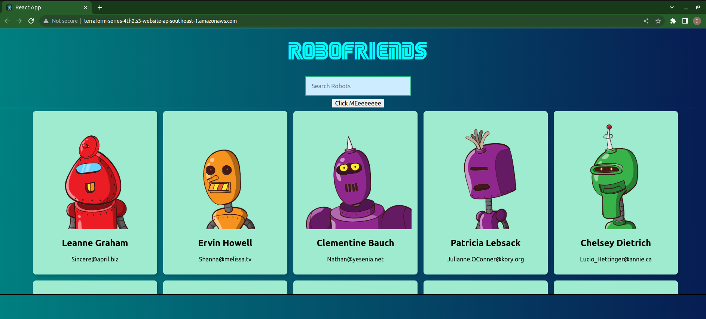

# Lab 4: Initial S3

## Init S3
S3 name follow by params `aws_s3_bucket.static.bucket` in `main.tf` file

We can put policy of S3 in .json file and load them via params `aws_s3_bucket_policy.static.policy`

## Upload file from local to S3
Following this path of code base in `main.tf`
```
locals {
  mime_types = {
    html  = "text/html"
    css   = "text/css"
    ttf   = "font/ttf"
    woff  = "font/woff"
    woff2 = "font/woff2"
    js    = "application/javascript"
    map   = "application/javascript"
    json  = "application/json"
    jpg   = "image/jpeg"
    png   = "image/png"
    svg   = "image/svg+xml"
    eot   = "application/vnd.ms-fontobject"
    ico   = "image/ico"
    txt   = "text/plain"
  }
}

resource "aws_s3_object" "object" {
  for_each = fileset(path.module, "static-web/**/*")
  bucket = aws_s3_bucket.static.id
  key    = replace(each.value, "static-web", "")
  source = each.value
  etag         = filemd5("${each.value}")
  content_type = lookup(local.mime_types, split(".", each.value)[length(split(".", each.value)) - 1])
}
```
So we can serve full frontend project via S3. In this case we serve a ReactJS webpage via S3. Step:
1. Run build ReactJS app by run `npm run build`
2. Copy file from folder `/build` to folder `static-web`
3. Run `terraform apply -auto-approve` to initial S3 in AWS. Open s3 domain to check ReactJS web page
